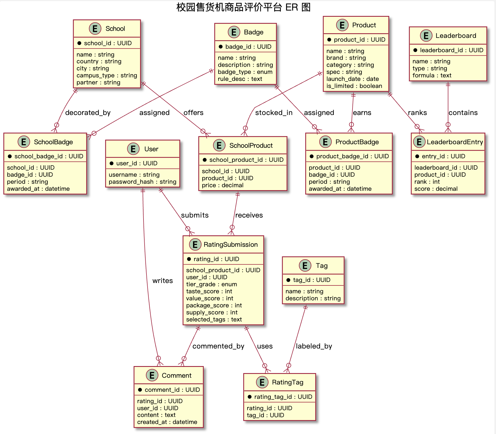

# Rate My Classmate – 功能说明

## 使用人群
不同学校的学生通过注册用户名与密码（支持学号或邮箱登录）后，可对同校或其他学校的同学进行打分、发表评论并查看榜单；校方和管理员通过后台监测反馈和管理内容。

## 被评对象
分布在不同学校校园内的学生（同学），可直接按学校、年级、专业/班级等维度浏览和搜索。

## 评分体系
- 评分等级：五档语义等级 `夯 > 顶级 > 人上人 > NPC > 拉完了`，内部映射分值 `夯=5, 顶级=4, 人上人=3, NPC=2, 拉完了=1`。
- 评分逻辑：每次打分会记录一个 1–5 的 `score`，系统统计每个同学各等级出现次数，并以出现最多的等级作为默认显示。同时在统计表中累积平均分与数量，支持榜单排序。
- 评论字段：评分时可附带文本评论，方便补充情感化描述。

## 额外/可选功能
- 排行榜：Top 10 综合榜、学校榜、年级榜，支持按周期（周/月/季度）自动生成并导出，数据源自评分统计表。
- 徽章体系：授予同学或学校的称号，如"年度最受欢迎同学""最佳学习伙伴""最友善学校"。
- 搜索与筛选：按学校、年级、班级、姓名、平均分区间等条件检索。
- 评分排序：按综合等级、平均分、最近 30 天变化率等维度排序。
- 评论聚合：按同学或学校查看全部评论，可按时间或热度排序。

## 交互特性
- 学生端：账号登录、提交评分、撰写/编辑/删除自己的评论。
- 评论区：按学校或同学查看，评论发布即刻生效，可按时间或热度排序。
- 校方/管理员后台可批量导出评分、配置标签、设置榜单周期并定义徽章条件。

---

## ER 模型概览
平台围绕"学生为不同学校的同学打分"这一场景，结合新表结构（students / schools / ratings / rating_summary 等），仅保留支撑评分、统计、榜单与徽章的必要实体。核心表如下：

| 实体 | 关键字段 | 说明 |
| --- | --- | --- |
| Student | student_id (PK)、school_id (FK)、name、grade、class、account、password_hash、created_at | 学生账户与被评主体，所有密码仅存哈希 |
| School | school_id (PK)、school_name、created_at | 学校档案，可扩展城市/类型等属性 |
| Rating | rating_id (PK)、rater_id (FK)、target_id (FK)、score（1–5）、comment、created_at | 评分记录（评分者≠被评分者，可设置 UNIQUE(rater_id, target_id)） |
| RatingSummary | target_id (PK, FK)、avg_score、rating_count、last_update | 评分冗余统计，供榜单与排序使用 |
| Badge | badge_id (PK)、name、description、type（student/school）、rule_desc | 徽章定义 |
| StudentBadge | student_badge_id (PK)、student_id (FK)、badge_id (FK)、period | 同学获徽记录 |
| SchoolBadge | school_badge_id (PK)、school_id (FK)、badge_id (FK)、period | 学校获徽记录 |
| Leaderboard | leaderboard_id (PK)、name、type、formula | 榜单定义（综合榜/学校榜/年级榜等） |
| LeaderboardEntry | entry_id (PK)、leaderboard_id (FK)、student_id (FK)、rank、score_snapshot | 榜单条目，score_snapshot 来源于 RatingSummary |
| SchoolApplication | application_id (PK)、applicant_id (FK)、applicant_name、applicant_account、school_name、contact、reason、status（pending/approved/rejected）、created_at、updated_at | 学校申请记录，学生可申请添加新学校，管理员审核后决定是否添加 |

### UML示意图

### 基数关系
- `School` 1:N `Student`。
- `Student` 1:N `Rating`（作为 rater），同时 `Student` 1:N `Rating`（作为 target）。
- `Rating` 对 `RatingSummary` 是 1:N（同一 target 聚合到 1 条 summary），推荐实现 1:1（每位同学一条统计）。
- `Badge` 1:N `StudentBadge` / `SchoolBadge`。
- `Leaderboard` 1:N `LeaderboardEntry`，`Student` 1:N `LeaderboardEntry`；榜单分值来自 `RatingSummary`。
- `Student` 1:N `SchoolApplication`；学生可以提交多个学校申请，每个申请对应一个学校。

